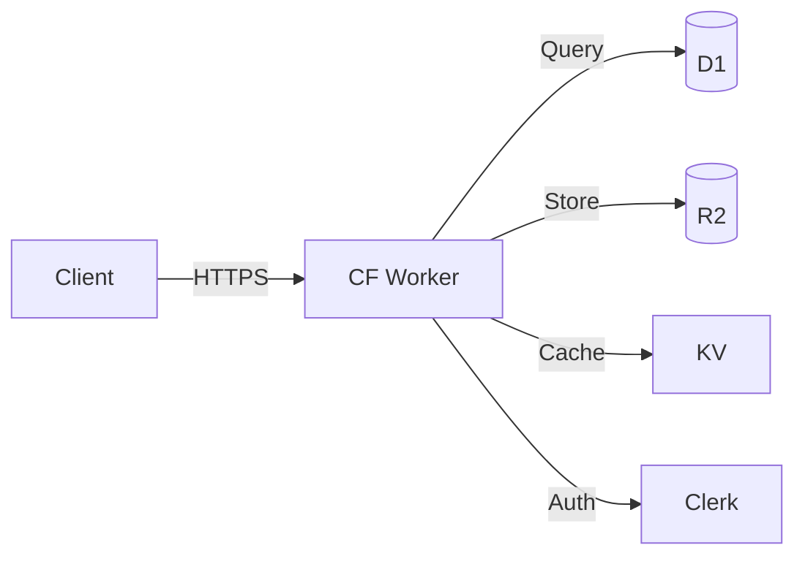
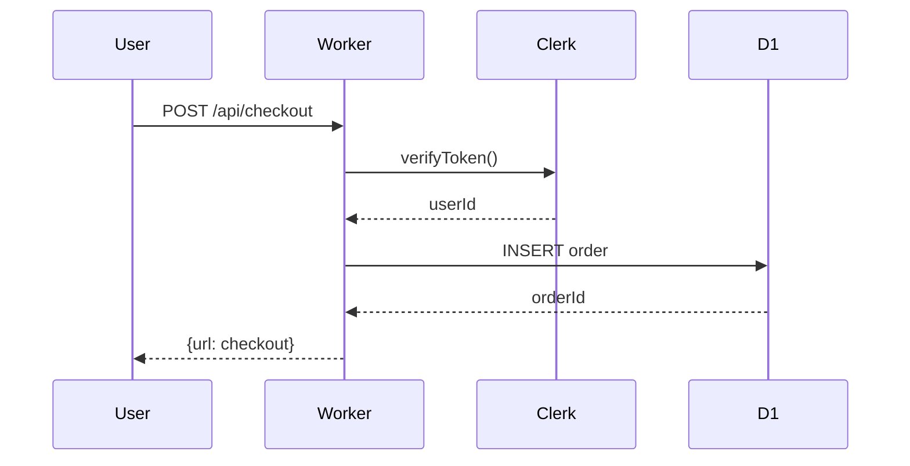
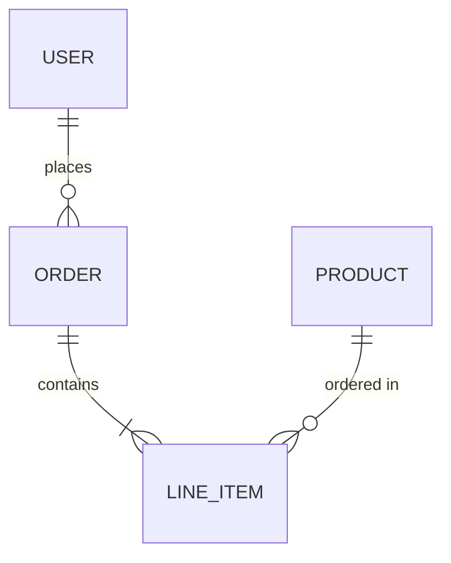

# Technical Diagramming

## Format Selection
ASCII: README/terminal/inline docs, zero dependencies, universal rendering. Mermaid: GitHub/GitLab auto-render, versioned in markdown, CI-friendly. SVG: high-fidelity exports, presentations, external docs. D2: declarative alternative to Mermaid, auto-layout.

| Context | Format | Why |
|---------|--------|-----|
| README | ASCII | renders everywhere, no extensions |
| GitHub PR/wiki | Mermaid | native rendering, diffable |
| Architecture doc | Mermaid+SVG export | version+present |
| Terminal output | ASCII | monospace guaranteed |
| Slide deck | SVG/PNG via freeze | high-fidelity |

## ASCII Diagrams
### Box-Drawing Characters
```
┌─────────┐    ┌──────────┐    ┌─────────┐
│  Client  │───▶│  Worker  │───▶│   D1    │
└─────────┘    └──────────┘    └─────────┘
                    │
                    ▼
              ┌──────────┐
              │    R2    │
              └──────────┘
```
Chars: `┌ ─ ┐ │ └ ┘ ├ ┤ ┬ ┴ ┼` for boxes | `─→ ──▶ ◀── ←─` for arrows | `···` for optional | `═══` for emphasis

### Reusable Architecture Template
```
┌──────────────────────────────────────────┐
│              Cloudflare Edge             │
│  ┌────────┐  ┌────────┐  ┌────────┐     │
│  │ Worker │  │  KV    │  │  R2   │     │
│  └───┬────┘  └────────┘  └────────┘     │
│      │                                   │
│  ┌───▼────┐  ┌────────┐                 │
│  │   D1   │  │  DO    │                 │
│  └────────┘  └────────┘                 │
└──────────────────────────────────────────┘
```

## Mermaid.js
### Diagram Types
flowchart (system arch) | sequence (API flows) | classDiagram (data models) | erDiagram (DB schema) | stateDiagram (state machines) | gantt (timelines) | C4Context (high-level arch)

### Flowchart


### Sequence


### ER Diagram


## Tools
`freeze` (charm.sh): code/diagram→PNG, terminal-native | `mmdc` (mermaid-cli): .mmd→SVG/PNG/PDF, CI integration | `d2` (terrastruct): declarative diagrams, auto-layout, themes | Excalidraw: hand-drawn aesthetic, collaborative, embeddable

### freeze Example
```bash
freeze --language mermaid -o arch.png diagram.mmd
```

### mermaid-cli
```bash
npx -p @mermaid-js/mermaid-cli mmdc -i diagram.mmd -o diagram.svg -t dark -b '#060610'
```

## Best Practices
Left-to-right flow (LR) default, top-to-bottom (TB) for hierarchies. Max 7±2 nodes per diagram — split complex systems into sub-diagrams. Label ALL edges — unlabeled arrows are ambiguous. Color for grouping not decoration — subgraphs with fills. Consistent spacing — align nodes vertically/horizontally. Dark theme: bg `#060610`, node fill `#1a1a2e`, text `#e0e0e0`, edge `#00E5FF`.

## Ownership
**Owns:** Diagram generation (ASCII+Mermaid+SVG+D2), architecture visualization, data flow diagrams, ER diagrams, deployment maps.
**Never owns:** Image generation (→image-gen), brand design (→09), UI mockups (→10).
